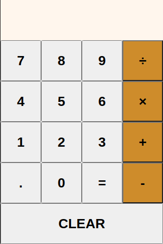
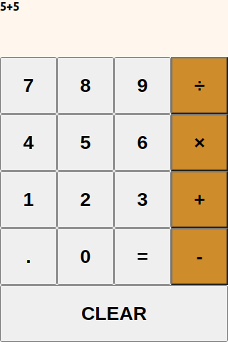

# About

This project was bootstrapped with [Create React App](https://github.com/facebook/create-react-app).

This is a simple calculator. It computes two numbers at a time. It can add, subtract, multiple, and divide. Decimals can be used in the calculator app as well.

## Implementations Explained

There are four classes used: App (Main), Input (Display of what user entered and results of computation), Button (Numbers, decimal, operators, clear, equals), and Clear.

## How to run the application on your local machine

### Clone app into your local machine

### `git clone https://github.com/tonyern/react-weather-app.git`

Go into your machine's terminal and navigate to a directory where you want this app to save in.

### `npm start`

Runs the app in the development mode.\
Open [http://localhost:3000](http://localhost:3000) to view it in the browser.

The page will reload if you make edits.\
You will also see any lint errors in the console.

### `npm test`

Launches the test runner in the interactive watch mode.\
See the section about [running tests](https://facebook.github.io/create-react-app/docs/running-tests) for more information.
